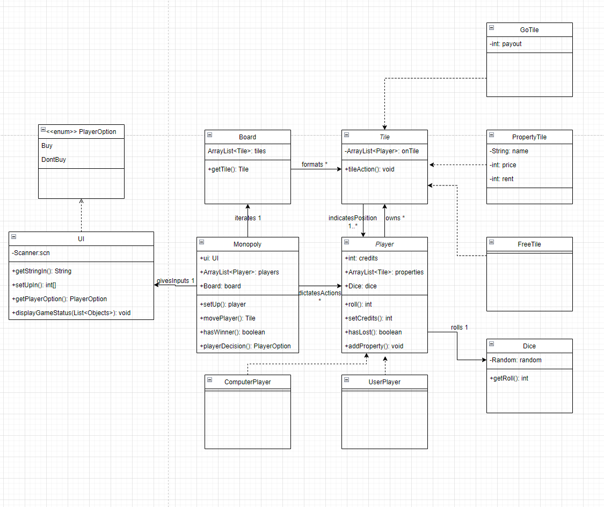

# The Indeded Desing
This is where you add your intended object oriented design of the monopoly game. The images should show when viewing the file in gitlab.  
Include the images in the repo, do not add links to external services etc.

## Design Notes
My pervious submission failed, but I do not recall it failing because of my diagrams, so I used the old ones. 
I could have redone them and based my new diagrams off the ones in the assignment 3repo which is easy to replicate 
without completely copying, therefore after seeing them now I am still going to go with the old ones because 
they have my original ideas about the structure of the game. I ask not to be deducted because of the differences 
between them especially because I feel my design could work if implemented.

## Class diagram

Insert a class diagram according to the assignment requirements. Feel free to add additional text and comments.

## Object diagram

Insert an object diagram according to the assignment requirements. Feel free to add additional text and comments.

## Sequence diagram

Insert a sequence diagram according to the assignment requirements. Feel free to add additional text and comments.